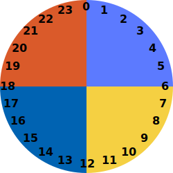
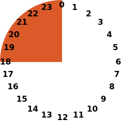

# is-x-time v1.0.0

Evaluate common time-of-day periods such as night-time or business-hours.

## Installation

Using npm:

```sh
$ npm i is-x-time
```

## Usage

```js
// Load full library
import * as IsXTime from "is-x-time";
// Load individual function(s)
import { isAfternoon, isBusinessHours, ... } 
```

## Complete list of is-x-time functions

#### `nowHour()`

Returns the current hour number `0 - 23`.

### NightTime, DayTime 


#### `isNightTime()`


Time is between `6:00pm` and `5:59am`, inclusive.

Time is between `18:00` and `05:59`, inclusive.

#### `isDayTime()`


Time is between `6:00am` and `5:59pm`, inclusive.

Time is between `06:00` and `17:59`, inclusive.

### Night, Morning, Afternoon, Evening



#### `isNight()`


Time is between `0:00am` and `5:59am`, inclusive.

Time is between `00:00` and `05:59`, inclusive.

#### `isMorning()`


Time is between `6:00am` and `11:59am`, inclusive.

Time is between `06:00` and `11:59`, inclusive.

#### `isAfternoon()`


Time is between `12:00pm` and `5:59pm`, inclusive.

Time is between `12:00` and `17:59`, inclusive.

#### `isEvening()`



Time is between `6:00pm` and `11:59pm`, inclusive.

Time is between `18:00` and `23:59`, inclusive.

### Business Hours (9 2 5)

#### `isBusinessHours()`


Time is between `9:00am` and `4:59pm`, inclusive.

Time is between `09:00` and `16:59`, inclusive.

### DayShift, EveningShift, NightShift

#### `isDayShift()`

Time is between `8:00am` and `3:59pm`, inclusive.

Time is between `08:00` and `15:59`, inclusive.

#### `isEveningShift()`

Time is between `4:00pm` and `11:59pm`, inclusive.

Time is between `16:00` and `23:59`, inclusive.

#### `isNightShift()`

Time is between `0:00am` and `7:59am`, inclusive.

Time is between `00:00` and `07:59`, inclusive.
