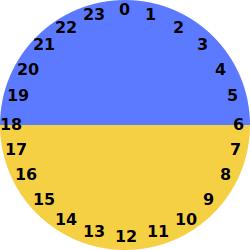
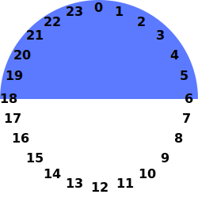
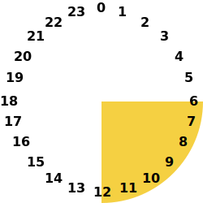
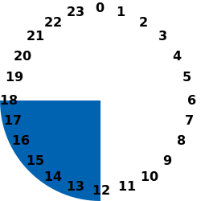
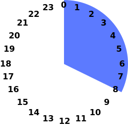

# is-x-time v1.0.0


Evaluate common time-of-day periods such as night-time or business-hours.

## Installation

Using npm:

```sh
npm i is-x-time
```

## Usage

```js
// CommonJS
const IsXTime = require('is-x-time');
// ES Modules
// Load full library
import * as IsXTime from "is-x-time";
// Load individual function(s)
import { isAfternoon, isBusinessHours, ... } from "is-x-time";
// Browser ES Modules
<script type="module" src="/path/to/is-x-time.mjs"></script>
<script type="module">
  import IsXTime from '/path/to/is-x-time.mjs';
  
  IsXTime.nowHour();
  // 0-23
</script>
// Browser UMD
<script type="module" src="/path/to/is-x-time.mjs"></script>
<script nomodule defer src="/path/to/web.is-x-time.js"></script>
```

## Complete list of is-x-time functions

### Current Hour

#### `nowHour()`


Returns the current hour number `0 - 23`.

#### `nowHourIn(tz: IANATimeZone)`

Returns the current hour number `0 - 23` of the specified [IANATimeZone](src/types/iana-tz.ts).
#### `nowHourInAWS(awsrc: AWSRegionCode)`

Returns the current hour number `0 - 23` of the specified [AWS Region Code](src/types/aws-region-codes.ts).

***

### NightTime, DayTime



***

#### `isNightTime()`



Time is between `6:00pm` and `5:59am`, inclusive.

Time is between `18:00` and `05:59`, inclusive.

#### `isNightTimeIn(tz: IANATimeZone)`

Time is between `6:00pm` and `5:59am`, inclusive, in specified [IANATimeZone](src/types/iana-tz.ts).

Time is between `18:00` and `05:59`, inclusive, in specified [IANATimeZone](src/types/iana-tz.ts).

#### `isNightTimeInAWS(awsrc: AWSRegionCode)`

Time is between `6:00pm` and `5:59am`, inclusive, in specified [AWS Region Code](src/types/aws-region-codes.ts).

Time is between `18:00` and `05:59`, inclusive, in specified [AWS Region Code](src/types/aws-region-codes.ts).

***

#### `isDayTime()`


Time is between `6:00am` and `5:59pm`, inclusive.

Time is between `06:00` and `17:59`, inclusive.
#### `isDayTimeIn(tz: IANATimeZone)`

Time is between `6:00am` and `5:59pm`, inclusive, in specified [IANATimeZone](src/types/iana-tz.ts).

Time is between `06:00` and `17:59`, inclusive, in specified [IANATimeZone](src/types/iana-tz.ts).
#### `isDayTimeInAWS(awsrc: AWSRegionCode)`

Time is between `6:00am` and `5:59pm`, inclusive, in specified [AWS Region Code](src/types/aws-region-codes.ts).

Time is between `06:00` and `17:59`, inclusive, in specified [AWS Region Code](src/types/aws-region-codes.ts).

***

### Night, Morning, Afternoon, Evening


***

#### `isNight()`


Time is between `0:00am` and `5:59am`, inclusive.

Time is between `00:00` and `05:59`, inclusive.
#### `isNightIn(tz: IANATimeZone)`

Time is between `0:00am` and `5:59am`, inclusive, in specified [IANATimeZone](src/types/iana-tz.ts).

Time is between `00:00` and `05:59`, inclusive, in specified [IANATimeZone](src/types/iana-tz.ts).
#### `isNightInAWS(awsrc: AWSRegionCode)`

Time is between `0:00am` and `5:59am`, inclusive, in specified [AWS Region Code](src/types/aws-region-codes.ts).

Time is between `00:00` and `05:59`, inclusive, in specified [AWS Region Code](src/types/aws-region-codes.ts).

***

#### `isMorning()`



Time is between `6:00am` and `11:59am`, inclusive.

Time is between `06:00` and `11:59`, inclusive.

#### `isMorningIn(tz: IANATimeZone)`

Time is between `6:00am` and `11:59am`, inclusive, in specified [IANATimeZone](src/types/iana-tz.ts).

Time is between `06:00` and `11:59`, inclusive, in specified [IANATimeZone](src/types/iana-tz.ts).

#### `isMorningInAWS(awsrc: AWSRegionCode)`

Time is between `6:00am` and `11:59am`, inclusive, in specified [AWS Region Code](src/types/aws-region-codes.ts).

Time is between `06:00` and `11:59`, inclusive, in specified [AWS Region Code](src/types/aws-region-codes.ts).

***

#### `isAfternoon()`



Time is between `12:00pm` and `5:59pm`, inclusive.

Time is between `12:00` and `17:59`, inclusive.
#### `isAfternoonIn(tz: IANATimeZone)`

Time is between `12:00pm` and `5:59pm`, inclusive, in specified [IANATimeZone](src/types/iana-tz.ts).

Time is between `12:00` and `17:59`, inclusive, in specified [IANATimeZone](src/types/iana-tz.ts).
#### `isAfternoonInAWS(awsrc: AWSRegionCode)`

Time is between `12:00pm` and `5:59pm`, inclusive, in specified [AWS Region Code](src/types/aws-region-codes.ts).

Time is between `12:00` and `17:59`, inclusive, in specified [AWS Region Code](src/types/aws-region-codes.ts).

***

#### `isEvening()`


Time is between `6:00pm` and `11:59pm`, inclusive.

Time is between `18:00` and `23:59`, inclusive.
#### `isEveningIn(tz: IANATimeZone)`

Time is between `6:00pm` and `11:59pm`, inclusive, in specified [IANATimeZone](src/types/iana-tz.ts).

Time is between `18:00` and `23:59`, inclusive, in specified [IANATimeZone](src/types/iana-tz.ts).
#### `isEveningInAWS(awsrc: AWSRegionCode)`

Time is between `6:00pm` and `11:59pm`, inclusive, in specified [AWS Region Code](src/types/aws-region-codes.ts).

Time is between `18:00` and `23:59`, inclusive, in specified [AWS Region Code](src/types/aws-region-codes.ts).

***

### Business Hours (9 2 5)

#### `isBusinessHours()`


Time is between `9:00am` and `4:59pm`, inclusive.

Time is between `09:00` and `16:59`, inclusive.
#### `isBusinessHoursIn(tz: IANATimeZone)`

Time is between `9:00am` and `4:59pm`, inclusive, in specified [IANATimeZone](src/types/iana-tz.ts).

Time is between `09:00` and `16:59`, inclusive, in specified [IANATimeZone](src/types/iana-tz.ts).
#### `isBusinessHoursInAWS(awsrc: AWSRegionCode)`

Time is between `9:00am` and `4:59pm`, inclusive, in specified [AWS Region Code](src/types/aws-region-codes.ts).

Time is between `09:00` and `16:59`, inclusive, in specified [AWS Region Code](src/types/aws-region-codes.ts).

***

### DayShift, EveningShift, NightShift


***

#### `isNightShift()`



Time is between `0:00am` and `7:59am`, inclusive.

Time is between `00:00` and `07:59`, inclusive.
#### `isNightShiftIn(tz: IANATimeZone)`

Time is between `0:00am` and `7:59am`, inclusive, in specified [IANATimeZone](src/types/iana-tz.ts).

Time is between `00:00` and `07:59`, inclusive, in specified [IANATimeZone](src/types/iana-tz.ts).
#### `isNightShiftInAWS(awsrc: AWSRegionCode)`

Time is between `0:00am` and `7:59am`, inclusive, in specified [AWS Region Code](src/types/aws-region-codes.ts).

Time is between `00:00` and `07:59`, inclusive, in specified [AWS Region Code](src/types/aws-region-codes.ts).

***

#### `isDayShift()`


Time is between `8:00am` and `3:59pm`, inclusive.

Time is between `08:00` and `15:59`, inclusive.
#### `isDayShiftIn(tz: IANATimeZone)`

Time is between `8:00am` and `3:59pm`, inclusive, in specified [IANATimeZone](src/types/iana-tz.ts).

Time is between `08:00` and `15:59`, inclusive, in specified [IANATimeZone](src/types/iana-tz.ts).
#### `isDayShiftInAWS(awsrc: AWSRegionCode)`

Time is between `8:00am` and `3:59pm`, inclusive, in specified [AWS Region Code](src/types/aws-region-codes.ts).

Time is between `08:00` and `15:59`, inclusive, in specified [AWS Region Code](src/types/aws-region-codes.ts).

***

#### `isEveningShift()`


Time is between `4:00pm` and `11:59pm`, inclusive.

Time is between `16:00` and `23:59`, inclusive122E-8542.
#### `isEveningShiftIn(tz: IANATimeZone)`

Time is between `4:00pm` and `11:59pm`, inclusive, in specified [IANATimeZone](src/types/iana-tz.ts).

Time is between `16:00` and `23:59`, inclusive, in specified [IANATimeZone](src/types/iana-tz.ts).
#### `isEveningShiftInAWS(awsrc: AWSRegionCode)`

Time is between `4:00pm` and `11:59pm`, inclusive, in specified [AWS Region Code](src/types/aws-region-codes.ts).

Time is between `16:00` and `23:59`, inclusive, in specified [AWS Region Code](src/types/aws-region-codes.ts).
